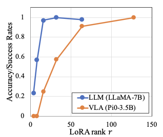
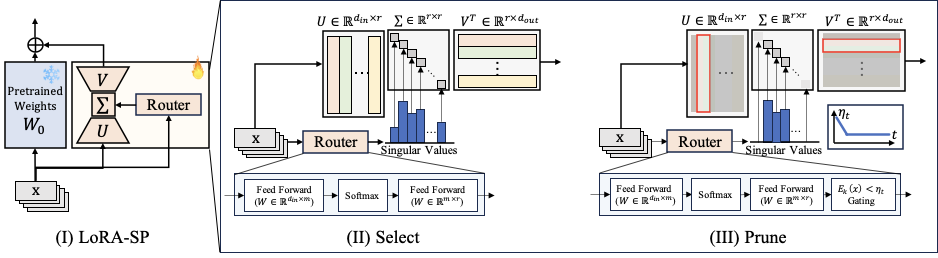
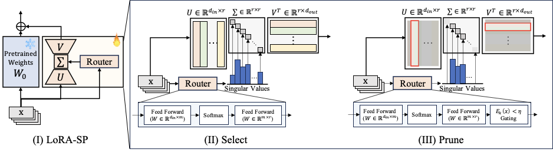
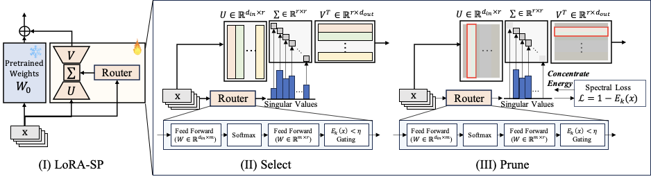
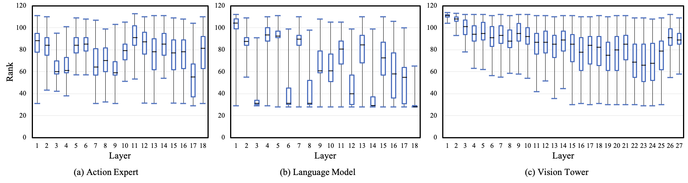
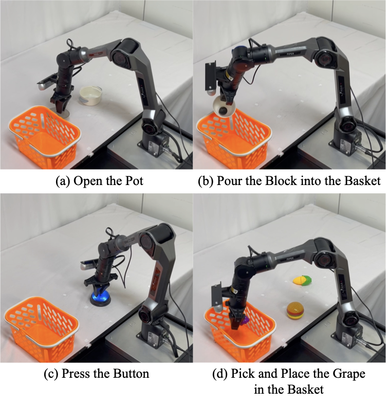

# LoRA-SP: Rank-Adaptive Fine-Tuning for Vision-Language-Action Models

> **Multi-Task Vision-Language-Action Learning with LoRA Select–Prune**
> ICRA 2026

**Authors:** Donghoon Kim, Minji Bae\*, Unghui Nam\*, Gyeonghun Kim\*, Suyun Lee\*, Kyuhong Shim†, Byonghyo Shim†

Seoul National University (ISLab) · Sungkyunkwan University
\* Equal contribution · † Corresponding authors

LoRA-SP (**Select–Prune**) is a rank-adaptive parameter-efficient fine-tuning (PEFT) method for Vision-Language-Action (VLA) models. It replaces fixed-rank LoRA updates with input- and layer-wise adaptive capacity, achieving strong multi-task performance with compact adapters.

---

## Motivation

Standard LoRA exposes a single rank hyperparameter that does not generalize uniformly across domains. Robotics transfer requires substantially larger ranks than language fine-tuning — π₀ (3.5B) needs ranks up to **r=128** to match full fine-tuning, whereas LLaMA-7B saturates at r∈{4,8}.

<p align="center">
  
</p>

In multi-task settings, a single fixed rank must serve heterogeneous tasks, causing cross-task interference and degraded generalization.

---

## Method

<p align="center">
  
</p>

LoRA-SP generalizes standard LoRA by replacing the fixed-rank update `ΔW = BA` with an input-conditioned SVD-style factorization:

```
ΔW_ℓ(x) = U_ℓ · diag(s_ℓ(x)) · V_ℓ
```

where `U_ℓ`, `V_ℓ` define a **shared vector bank** (initialized wide at r=128), and `s_ℓ(x) ≥ 0` are **singular-value-like scores** produced by a lightweight router per input.

### Select: Energy-based Active Rank

<p align="center">
  
</p>

The router scores are sorted and the **effective rank** `k` is the smallest index satisfying:

```
E_k(x) = Σᵢ₌₁ᵏ sᵢ(x)² / Σⱼ₌₁ʳ sⱼ(x)² ≥ η
```

Since `E_k(x)` bounds the relative Frobenius approximation error as `√(1 − E_k(x))`, the threshold `η` is a direct accuracy–efficiency knob (e.g., η=0.9 ⟹ ≤ 31.6% relative error). Vectors beyond rank `k` are zeroed for that input.

### Prune: Spectral Concentration Loss

<p align="center">
  
</p>

A spectral loss reinforces the surviving vectors:

```
L_spec(x) = 1 − E_k(x)
```

This creates a positive feedback loop: selected vectors receive stronger gradients, their singular values grow, and they dominate future selections. Over training, singular-value mass concentrates on a **small stable set of directions** while the task loss prevents accuracy collapse.

**Total training objective:**

```
L = E[L_task] + 1e-2 · E[L_spec] + 1e-3 · E[L_router]
```

where `L_router` includes load-balance and z-loss terms.

### Layer-wise Rank Distribution

<p align="center">
  
</p>

LoRA-SP automatically concentrates high rank in the **vision module** (which requires rich spatial updates) while pruning the language and action modules to low rank — something a fixed global rank cannot achieve.

---

## Experiments

### Setup

<p align="center">
  
</p>

- **Robot:** AgileX PiPER (7-DoF), an embodiment unseen during VLA pretraining
- **Tasks:** Open the Pot · Pour the Block · Press the Button · Pick and Place (×120 demos each, 480 total)
- **Views:** Side-view + wrist-mounted RGB cameras
- **Backbones:** π₀ (PaLIGemma-3.5B) and SmolVLA (SmolVLM-2-based)
- **Baselines:** Full FT, LoRA (r∈{16,32,64,128}), AdaLoRA, LoRA-MoE (top-1 / weighted)

### Main Results

| Method | π₀ Multi-Task Avg | SmolVLA Multi-Task Avg |
|---|---|---|
| Full Fine-Tuning | Best | Best |
| LoRA (r=128) | Baseline | Baseline |
| AdaLoRA | ≈ LoRA | ≈ LoRA |
| LoRA-MoE (weighted) | ≈ LoRA | ≈ LoRA |
| **LoRA-SP (ours)** | **+23.3% over LoRA** | **+31.6% over LoRA** |

LoRA-SP matches or exceeds full fine-tuning across tasks while updating significantly fewer parameters and remaining **robust to rank choice**.

---

## Supported Policies & Adapters

| Policy | Supported Adapter Methods |
|---|---|
| π₀ (PaLIGemma-3.5B) | LoRA, QLoRA, LoRA-MoE, AdaLoRA, **LoRA-SP** |
| SmolVLA (SmolVLM-2) | LoRA, QLoRA, LoRA-MoE, AdaLoRA, **LoRA-SP** |

---

## Installation

```bash
git clone https://github.com/dhkim-furiosa/LoRA-SP.git
cd LoRA-SP

# Recommended: conda environment with Python 3.11
conda create -n lora-sp python=3.11 -y
conda activate lora-sp

pip install -U pip
pip install -r requirements.txt
conda install -c conda-forge av ffmpeg -y
```

---

## Usage

### Training

```bash
python scripts/train.py --config_path=configs/train.py \
    --train_dataset.repo_id=<your_dataset>
```

**Key configuration** in `scripts/train.py`:

```python
cfg.method.core = 'lora_msp'          # LoRA-SP
cfg.method.lora_cfg = LoraMSPConfig(
    r=128,
    alpha=256,
    num_experts=128,                   # vector bank size = r
    target_threshold_init=0.9,         # energy threshold η
    use_spec_loss=True,                # spectral concentration loss
)
cfg.method.target_keywords = [
    ".q_proj", ".k_proj", ".v_proj", ".o_proj",
    ".gate_proj", ".up_proj", ".down_proj", ".out_proj"
]
```

**Distributed training:**
```bash
bash scripts/bash/run.sh        # single-node multi-GPU (DDP)
bash scripts/bash/run_fsdp.sh   # FSDP
```

### Evaluation

**Offline (on dataset):**
```bash
python scripts/eval_ours.py \
    --policy.path=/path/to/checkpoint/pretrained_model \
    --train_dataset.repo_id=<your_dataset>
```

**Real-time (on robot):**
```bash
python scripts/eval_real_time.py \
    --policy.path=/path/to/checkpoint/pretrained_model \
    --task="open the pot"
```

---

## Project Structure

```
.
├── common/
│   ├── datasets/          # Dataset loading, transforms, LeRobot format
│   ├── optim/             # Optimizers and LR schedulers
│   ├── policies/
│   │   ├── lora.py        # Standard LoRA
│   │   ├── lora_msp.py    # LoRA-SP (Select-Prune) ← main contribution
│   │   ├── lora_moe.py    # LoRA-MoE baseline
│   │   ├── lora_ada.py    # AdaLoRA baseline
│   │   ├── pi0/           # π₀ policy
│   │   └── smolvla/       # SmolVLA policy
│   ├── robot_devices/     # AgileX PiPER drivers
│   └── utils/
├── configs/               # Training / eval configs
├── scripts/
│   ├── train.py           # Training entry point
│   ├── eval_ours.py       # Offline evaluation
│   ├── eval_real_time.py  # Real-time robot evaluation
│   └── bash/              # Shell scripts (DDP/FSDP launch, CAN setup)
├── assets/                # Paper figures
└── requirements.txt
```

---

## Citation

```bibtex
@inproceedings{kim2026lorasp,
  author    = {Donghoon Kim and Minji Bae and Unghui Nam and Gyeonghun Kim and Suyun Lee and Kyuhong Shim and Byonghyo Shim},
  title     = {Multi-Task Vision-Language-Action Learning with {LoRA} Select--Prune},
  booktitle = {IEEE International Conference on Robotics and Automation (ICRA)},
  year      = {2026},
  url       = {https://github.com/dhkim-furiosa/LoRA-SP},
}
```

---

## Acknowledgements

This codebase builds on [LeRobot](https://github.com/huggingface/lerobot) by HuggingFace. The π₀ and SmolVLA policy implementations follow their respective original works.
